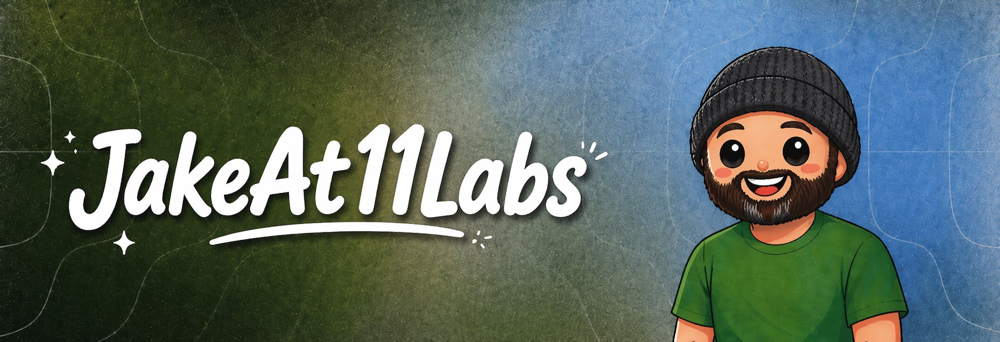

  

  Public work around ElevenLabs, voice AI, agents, and developer systems.

  <a href="https://elevenlabs.io">ElevenLabs</a>
  ·
  <a href="https://elevenlabs.io/api">ElevenAPI</a>
  ·
  <a href="https://elevenlabs.io/docs">Docs</a>
  ·
  <a href="https://github.com/jakerains">@jakerains</a>

This is the work-side counterpart to my personal GitHub. Personal experiments live on [`@jakerains`](https://github.com/jakerains); this profile stays focused on the world around ElevenLabs.

## Current Focus

- Voice AI experiences that feel expressive, natural, and production-ready.
- Agent workflows, skills, and developer tooling.
- Technical surfaces that feel clear, warm, and useful.

## Featured Repositories

| Repository | Focus |
| --- | --- |
| [`elevenlabs-brand-kit`](https://github.com/jakeat11labs/elevenlabs-brand-kit) | Brand-system and web-surface work shaped around the ElevenLabs visual language. |
| [`agentskills`](https://github.com/jakeat11labs/agentskills) | A public agent-skills library for modern coding-agent workflows and multi-agent setups. |
